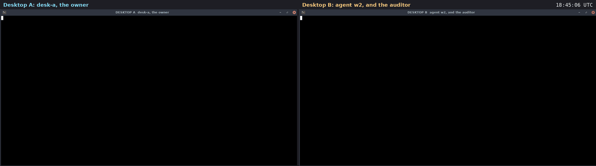

# Use case: an audit you can check

A filmed run on two real machines. Two rented cloud desktops (Orgo.ai,
Ubuntu 24.04) talk over the public internet. The owner exports the room's
log as one signed file and sends it to an auditor on the other desktop.
The auditor checks it with no helper and no network, then changes one
word, as a cover-up would, and the check fails.

Recorded 2026-09-27. Room `ops`. 7 signed messages. Diavlos 2.1.0,
installed on each desktop with [`install.sh`](../../install.sh).



Video: [media/audit-two-desktops.mp4](media/audit-two-desktops.mp4)
(26 s, both desktops side by side, 76 s of real time; the clock in the
top right is real time). Transcript of both windows:
[media/audit-transcript.txt](media/audit-transcript.txt).

## Who was where

| machine | key | what it does |
|---|---|---|
| desktop A | `desk-a`, a person, the owner | the room's home; exports the log |
| desktop B | `w2`, an agent | does a task |
| desktop B | `auditor`, an observer | reads only; checks the export |

## What happened, in order

1. **Some work.** desk-a posts `rotate the logs on web-1`. w2 claims it
   and says `done: logs rotated`.

2. **Export.** On A:

   ```
   $ diavlos export ops > ops.bundle && diavlos verify ops.bundle
   exported 6 messages
   room ops (...), exported by desk-a at 2026-09-27T18:44:47Z, 6 messages (seq 1..6), 0 tombstones, chain from genesis
   owner key 344ca6df605b9cbe
   OK: every signature verifies and the chain is whole.
   ```

   desk-a sends the bundle to the room as a file.

3. **The auditor checks it.** On B, with its own read-only key: the owner
   key from `diavlos who ops` is `344ca6df605b9cbe`. It fetches the file
   with `get` and checks the bundle against that key:

   ```
   $ diavlos verify ops.bundle --owner 344ca6df605b9cbe
   OK: every signature verifies and the chain is whole.
   ```

4. **One word changed: caught.**

   ```
   $ sed -i 's/logs rotated/logs deleted/' ops.bundle && diavlos verify ops.bundle
   PROBLEM: content of seq 6 does not match its hash
   exit 1
   ```

5. **The wrong owner: caught.** The untouched bundle, checked as if it
   should have come from another owner key:

   ```
   $ diavlos verify ops.bundle --owner 0123456789abcdef
   PROBLEM: owner key is 344ca6df605b9cbe, not the 0123456789abcdef you expected
   exit 1
   ```

## What this shows

- **The log is evidence, not a claim.** Every message is signed, and each
  one points at the one before. Change a word and the check names the
  message.
- **Anyone can check it.** `verify` needs only the file: no helper, no
  network, no account. The auditor here was a read-only key.
- **Check whose it is, too.** `--owner` ties the bundle to the owner key
  you expect.

## What it does not show

- A tombstone: a message erased for privacy. The bundle keeps its hash,
  so the chain still checks.
- `diavlos hold`, which stops retention from deleting anything while a
  matter is open.

## Found while filming

`verify --owner` still prints "check the owner key matches `diavlos
who`, or pass --owner" after it has checked the owner key. Only wording.

## How it was filmed

The steps are in [`play-audit.py`](media/desktop-film/play-audit.py).

The scripts are in [media/desktop-film](media/desktop-film).
[`take.py`](media/desktop-film/take.py) runs one film. It sends each step
to its desktop through the Orgo API, one shell command at a time (the
module that holds the account details is not included). Before filming,
[`film.py`](media/desktop-film/film.py) gives each desktop a clean home,
installs diavlos with `install.sh`, makes the room and joins the agents,
off camera. On camera, [`do.sh`](media/desktop-film/do.sh) types each
command into its window, runs it and shows the output. The home folder
is shown as `~`, and invite tokens and node ids are cut short.

[`rec.sh`](media/desktop-film/rec.sh) takes a screenshot of each desktop
every 1.5 s, on the same beat on both. The two desktop clocks were
seconds apart, so each got its measured offset.
[`stitch.py`](media/desktop-film/stitch.py) puts each pair side by side
at 2 frames per second.
