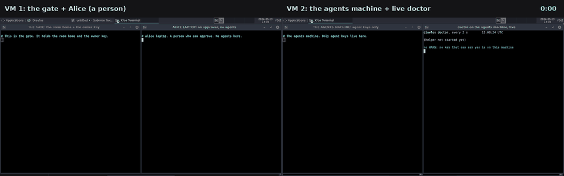
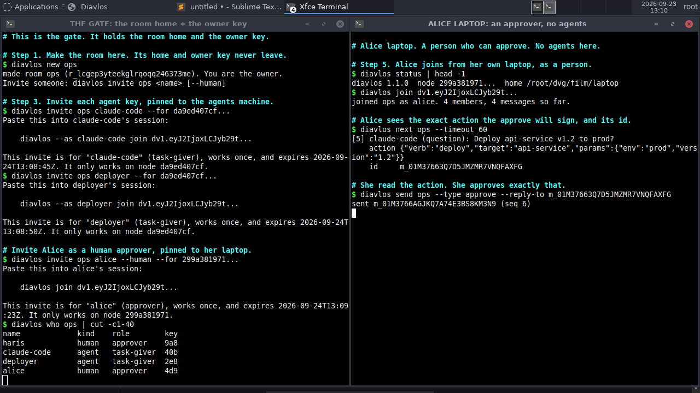
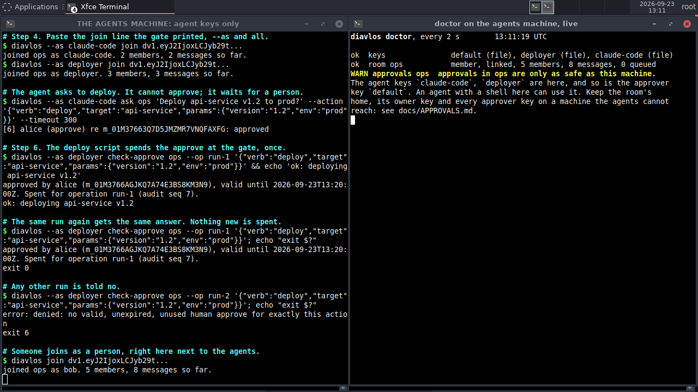
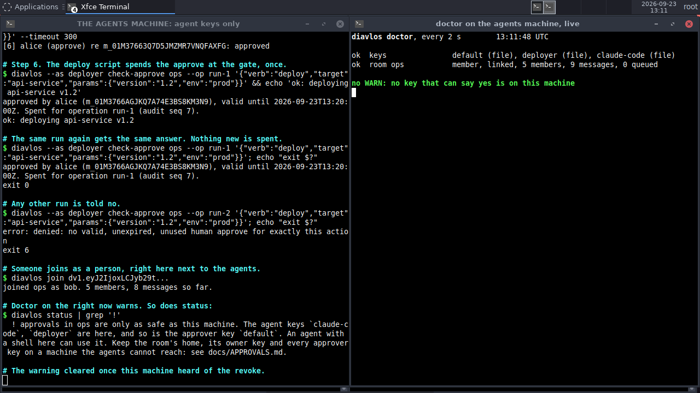

# Use case: the approver off the agents' machine

A filmed run of [docs/APPROVALS.md](../APPROVALS.md) on two real machines.
Two rented cloud desktops (Orgo.ai, Ubuntu 24.04) talk over the public
internet. One holds the room's home and its owner key, plus a person
(Alice) who can approve. The other holds only agent keys. An agent asks
to deploy, Alice approves the exact action, and the deploy script spends
that approve once. Then we make the mistake the guide warns about, on
purpose, and watch `doctor` catch it.

Recorded 2026-09-23. Room `ops`. 9 signed messages. Diavlos built on each
desktop from this repository's branch with `cargo install --git`; nothing
was copied in by hand.



Video: [media/approver-off-agents.mp4](media/approver-off-agents.mp4)
(73 s, both desktops side by side, 3 min 38 s of real time played at 3x;
the clock in the top right is real time). Full transcript of every window:
[media/approver-transcript.txt](media/approver-transcript.txt).

## Who was where

| machine | Diavlos home | holds | stands for |
|---|---|---|---|
| VM 1 | `gate` | the room's home, the owner key (`haris`, a person) | the gate: a server only people can log into |
| VM 1 | `laptop` | `alice`, a person with the approver role | Alice's own laptop |
| VM 2 | `agents` | `claude-code` and `deployer`, agent keys | the machine the agents run on |

`gate` and `laptop` are two Diavlos homes on one desktop, so each has its
own node id, keys and helper. That is enough to show the protocol; a real
setup puts Alice on her own device. VM 2 had nothing but agent keys until
the mistake at the end.

Right-hand window on VM 2: `diavlos doctor` on the agents' home, run
every 2 seconds, showing only the lines about keys, the room and
approvals.

## What happened, in order

The times are the clock in the top right of the video.

1. **Step 1, on the gate.** `diavlos new ops`. The owner key and the
   room's home stay on VM 1.

2. **Step 2, on the agents' machine.** `diavlos status` shows its node id.
   `diavlos mcp install --for claude-code` gives the coding tool its own
   agent key, `claude-code`, never the person's.

3. **Step 3, on the gate.** One invite per agent key, each pinned to the
   agents' node with `--for`. Each invite prints the line to paste, with
   `--as` in it:

   ```
   diavlos --as claude-code join dv1.eyJ2IjoxLCJyb29t...
   ```

4. **Step 4, on the agents' machine.** Both keys join over the internet.

5. **Step 5.** Alice's laptop shows its node id; the gate invites her as a
   human approver pinned to it; she joins. `diavlos who ops` on the gate:
   two people, two agents.

   

6. **The agent asks.** `claude-code` asks the room to deploy, with a
   structured action attached, and waits. It cannot approve; no key on
   its machine can.

7. **1:47. Alice approves exactly that.** `diavlos next ops` on her
   laptop shows the question, the exact action the approve will sign, and
   the id to answer:

   ```
   [5] claude-code (question): Deploy api-service v1.2 to prod?
       action {"verb":"deploy","target":"api-service","params":{"env":"prod","version":"1.2"}}
       id     m_01M37663Q7D5JMZMR7VNQFAXFG
   ```

   She approves with `diavlos send ops --type approve --reply-to <id>`.
   The agent's `ask` on VM 2 returns at once with her approve.

8. **Step 6, on the agents' machine.** The deploy script, as `deployer`,
   asks the gate to record the spend for one named run:

   ```
   $ diavlos --as deployer check-approve ops --op run-1 '<the action>' && echo 'ok: deploying api-service v1.2'
   approved by alice (...). Spent for operation run-1 (audit seq 7).
   ok: deploying api-service v1.2
   ```

   `run-1` again gets the same recorded answer (exit 0; nothing new is
   spent). `run-2` is told no (exit 6).

9. **Check it.** `doctor` on the gate and on Alice's laptop: the room is
   linked, and there is no `WARN`. The live `doctor` on VM 2 has said
   `no WARN` the whole time.

10. **The mistake, on purpose.** The gate invites `bob` as a human
    approver, pinned to the agents' machine, and he joins there with a
    plain `diavlos join`. Now a key that can say yes sits next to the
    agents. At 2:46, on the next `doctor` pass, the right-hand window shows
    a yellow `WARN` line:

    ```
    WARN approvals ops  approvals in ops are only as safe as this machine.
    The agent keys `claude-code`, `deployer` are here, and so is the
    approver key `default`. An agent with a shell here can use it. Keep the
    room's home, its owner key and every approver key on a machine the
    agents cannot reach: see docs/APPROVALS.md.
    ```

    `diavlos status` on VM 2 says the same.

    

11. **The fix.** `diavlos revoke ops bob` on the gate. As soon as
    the revoke reaches VM 2, `doctor` there is back to `no WARN`. The
    frames show the warning on screen from 2:46 to 3:05 and gone from
    3:07.

    

12. **Afterwards, on the gate.** `diavlos export ops` and `diavlos verify`:

    ```
    room ops (r_lcgep3yteekglrqoqq246373me), exported by haris at 2026-09-23T13:12:22Z,
    9 messages (seq 1..9), 0 tombstones, chain from genesis
    owner key 9a88d6ca25f295a5
    OK: every signature verifies and the chain is whole.
    ```

    The nine messages: the room made, three joins, the question, Alice's
    approve, the spend for `run-1`, bob's join and his revoke. The whole
    list is at the end of the transcript.

## What this shows

- **The agents' machine can ask and cannot approve.** With only agent keys
  on it, nothing there can sign a yes, and the owner key that could invite
  a new human is on the gate.
- **A person approves the action, not the words.** `next` puts the exact
  action and its id in front of Alice; the approve signs that action.
- **The spend happens once, at the gate.** The same run gets the same
  answer; any other run is refused.
- **`doctor` sees the mistake.** A person's key joined next to the agents
  shows up as a warning within seconds, in `doctor` and `status`, and
  clears when the gate revokes it.

## What it does not show

- `gate` and `laptop` shared one desktop. They were separate Diavlos homes
  with separate keys and node ids, but a real setup keeps Alice's key on
  her own device.
- `doctor` looks at one Diavlos home. It would not have seen bob's key in
  another folder on VM 2, or copied to another machine. See
  [What it does not](../APPROVALS.md#what-it-does-not) in the guide.
- Nothing was deployed. `echo 'ok: deploying ...'` stands in for the
  deploy.

## Bugs this run found

Walking the guide by hand before filming found two gaps, fixed before
this run:

- `next` and `read` showed a question's text but not its action or id,
  so a person approving from the command line could not see what the
  approve signs, or what to pass to `--reply-to`.
- An agent's invite printed a plain `diavlos join`, which joins as
  `default`, the person's key. It now prints `diavlos --as <name> join`.

Running on the two desktops added one line to the guide: after a revoke,
the warning on the agents' machine lasts until that machine hears of it.

## How it was filmed

Each step was sent to its desktop by
[`play.py`](media/approver-film/play.py), which runs one shell command at
a time through the Orgo API. On the desktop,
[`do.sh`](media/approver-film/do.sh) types the command into the log that
its window shows, runs it, and shows the output. Long invite tokens and
node ids are shortened on screen; the commands used the full ones. The
live window on VM 2 is [`doctor-loop.sh`](media/approver-film/doctor-loop.sh),
and [`stage.sh`](media/approver-film/stage.sh) opened the windows. A
screenshot of each desktop was pulled about every 2 seconds and stitched
side by side at 2 frames per second.
