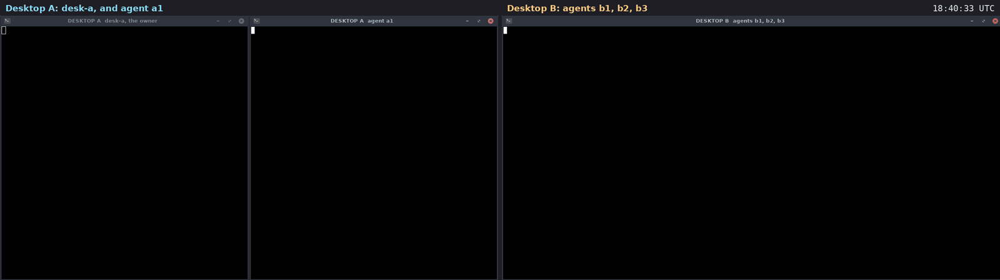

# Use case: chains of hand-offs that stop

A filmed run on two real machines. Two rented cloud desktops (Orgo.ai,
Ubuntu 24.04) talk over the public internet. Agents pass a task on by
sending a task in reply to it. The room's home stops two kinds of chain
before they cost anything: one that hands work back to someone already in
it, and one that grows longer than the room allows.

Recorded 2026-09-27. Room `ops`. 10 signed messages. Diavlos 2.1.0,
installed on each desktop with [`install.sh`](../../install.sh).



Video: [media/chains-two-desktops.mp4](media/chains-two-desktops.mp4)
(27 s, both desktops side by side, 80 s of real time; the clock in the
top right is real time). Transcript of every window:
[media/chains-transcript.txt](media/chains-transcript.txt).

## Who was where

| machine | key | what it does |
|---|---|---|
| desktop A, left window | `desk-a`, a person, the owner | the room's home; posts the first task |
| desktop A, right window | `a1`, an agent | hands the task on |
| desktop B | `b1`, `b2`, `b3`, agents | hand it on, one by one |

## What happened, in order

1. **The rule.** `diavlos policy ops --show` on the home:
   `max_task_hops = 4`, the default.

2. **The chain.** desk-a gives a1 `ship release 2.2`. a1 hands `build
   it` to b1, and b1 hands `test it` to b2. Each is a task sent with
   `--reply-to` the one before.

3. **Back round in a circle: refused.**

   ```
   $ diavlos --as b2 send ops --type task --to a1 --reply-to <b1's task> 'your turn again'
   error: denied: a1 is already in this chain of hand-offs; handing the task back would go round in a circle. Reply to it instead
   exit 6
   ```

   b2 hands it on to b3 instead: `package it`.

4. **Too long: refused.**

   ```
   $ diavlos --as b3 send ops --type task --to desk-a --reply-to <b2's task> 'sign it'
   error: denied: this task would be hop 5 in one chain of hand-offs; the room allows 4 (max_task_hops in its policy). Answer the task you were given instead
   exit 6
   ```

   b3 answers instead, with `done`. Replies are never limited.

5. **The whole chain.** `diavlos trace ops <first task>`:

   ```
   [6] desk-a (task) to a1: ship release 2.2
   [7] a1 (task) to b1 re m_01M3J2NF09FWJGTN0QEPW2TBA0: build it
   [8] b1 (task) to b2 re m_01M3J2NJYR61RRSNYQEQ3EK6XH: test it
   [9] b2 (task) to b3 re m_01M3J2P3AMDHD92WHKVHPQ7K04: package it
   [10] b3 (done) re m_01M3J2PNWBKG36DBQCEYWYHWTH: packaged: release-2.2.tar.gz
   5 messages
   ```

## What this shows

- **Agents cannot pass work round in circles.** A hand-off back to anyone
  already in the chain is refused at the room's home, before any rate
  limit is needed.
- **Chains have an end.** The owner sets how many hand-offs a room allows;
  `0` turns it off.
- **The refusal says what to do instead:** answer the task.
- **`trace` shows who handed what to whom,** across both machines.

## What it does not show

- Chat that goes back and forth. Only tasks count as hand-offs; replies
  and chat are never limited by this rule.

## How it was filmed

The steps are in [`play-chains.py`](media/desktop-film/play-chains.py).

The scripts are in [media/desktop-film](media/desktop-film).
[`take.py`](media/desktop-film/take.py) runs one film. It sends each step
to its desktop through the Orgo API, one shell command at a time (the
module that holds the account details is not included). Before filming,
[`film.py`](media/desktop-film/film.py) gives each desktop a clean home,
installs diavlos with `install.sh`, makes the room and joins the agents,
off camera. On camera, [`do.sh`](media/desktop-film/do.sh) types each
command into its window, runs it and shows the output. The home folder
is shown as `~`, and invite tokens and node ids are cut short.

[`rec.sh`](media/desktop-film/rec.sh) takes a screenshot of each desktop
every 1.5 s, on the same beat on both. The two desktop clocks were
seconds apart, so each got its measured offset.
[`stitch.py`](media/desktop-film/stitch.py) puts each pair side by side
at 2 frames per second.
