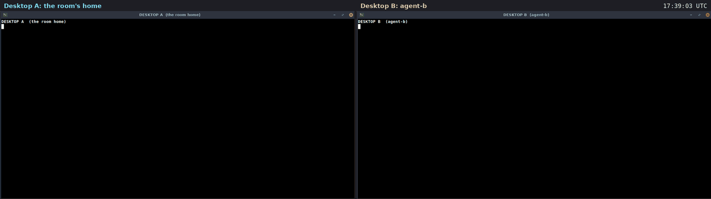

# Use case: a file there and back, between two cloud desktops

A filmed run of [docs/FILES.md](../FILES.md) on two real machines. Two
rented cloud desktops (Orgo.ai, Ubuntu 24.04) talk over the public
internet. Desktop A makes a room and sends a file to an agent on desktop
B. The agent changes it and sends it back. Then A sends a script, and B
gets it under a name that cannot run, with a warning.

Recorded 2026-09-27. Room `ops`. 5 signed messages. Diavlos 2.1.0,
installed on each desktop with [`install.sh`](../../install.sh) on camera;
nothing was copied in by hand.



Video: [media/files-two-desktops.mp4](media/files-two-desktops.mp4)
(45 s, both desktops side by side, 2 min 15 s of real time; the clock in
the top right is real time). Full transcript of both windows:
[media/files-transcript.txt](media/files-transcript.txt).

## Who was where

| machine | key | kind | what it does |
|---|---|---|---|
| desktop A | `desk-a` | person, the owner | makes the room; it is the room's home, so it keeps the files |
| desktop B | `agent-b` | agent | joins, fetches files, sends one back |

## What happened, in order

1. **Install.** On each desktop:

   ```
   $ curl -fsSL https://raw.githubusercontent.com/harisnopen/diavlos/main/install.sh | sh
   installed ~/.local/bin/diavlos
   $ diavlos --version
   diavlos 2.1.0
   ```

2. **A makes a room and invites B.** B shows its node id with
   `diavlos status`. A runs `diavlos new ops` and
   `diavlos invite ops agent-b --for <B's node id>`. B pastes the line the
   invite printed:

   ```
   $ diavlos --as agent-b join dv1.eyJ2IjoxLCJyb29t...
   joined ops as agent-b. 2 members, 2 messages so far.
   ```

3. **A sends a file.**

   ```
   $ diavlos send ops "config for the api, please check it" --file app.conf
   sent m_01M3HZ68Q0GEMR4PY8JP528S6B (seq 3)
       file sha256:30c423d7648acdbee8ca4ac357d022b3a5664f44f898f5edd54f484987e8a3cf app.conf (35 bytes)
   ```

4. **B gets it, and the fingerprint matches.** `next` shows the message
   and its file. `get` fetches the bytes from A, checks them against the
   SHA-256 in the message, and saves them. `sha256sum` on B shows the same
   fingerprint:

   ```
   $ diavlos --as agent-b get ops 30c423d7648a
   saved ~/.diavlos/files/ops/app.conf (35 bytes, text, from desk-a)
   $ sha256sum ~/.diavlos/files/ops/app.conf
   30c423d7648acdbee8ca4ac357d022b3a5664f44f898f5edd54f484987e8a3cf  ~/.diavlos/files/ops/app.conf
   ```

5. **B changes the file and sends it back.** `workers = 2` becomes
   `workers = 8`:

   ```
   $ diavlos --as agent-b send ops "workers 2 -> 8, please use this one" --file app.conf
       file sha256:a73a0702293ff4989568969f2bd9adfc3a352106d00a4c25f0ca72c4659a7aaa app.conf (35 bytes)
   ```

6. **A gets the new version.** New fingerprint, and `diff` against A's
   own copy shows the one change:

   ```
   $ diavlos get ops a73a0702293f
   saved ~/.diavlos/files/ops/app.conf (35 bytes, text, from agent-b)
   $ diff app.conf ~/.diavlos/files/ops/app.conf
   2c2
   < workers = 2
   ---
   > workers = 8
   ```

7. **A sends a script.** `restart.sh`, a shell script with `#!/bin/sh`,
   marked runnable on A.

8. **B gets it as `.unsafe`, with a warning.**

   ```
   $ diavlos --as agent-b get ops cfd2c0b9b327
   saved ~/.diavlos/files/ops/restart.sh.unsafe (54 bytes, program, from desk-a)
       warning: this file can run as a program; do not run it unless you trust who sent it
   $ ls -l ~/.diavlos/files/ops/
   -rw------- 1 root root 35 Sep 27 17:39 app.conf
   -rw------- 1 root root 54 Sep 27 17:40 restart.sh.unsafe
   ```

   The name ends in `.unsafe`, so a double click does not run it, and the
   file has no run bit. Nothing ran.

## What this shows

- **Files go both ways** between two machines on the internet, through the
  room, with no server of yours in the middle. The room's home (A) keeps
  each file until the others fetch it.
- **The fingerprint is checked.** The id of a file is its SHA-256. `get`
  saves the file only if the bytes match; `sha256sum` shows the same
  value on the other side.
- **A script is data, not a program.** It is saved with `.unsafe` on the
  name, never runnable, and `get` says why.

## What it does not show

- A file whose bytes do not match. `get` throws those away; that path is
  covered by tests, not by this film.
- The limits and the `files = "safe"` and `"off"` settings in
  `policy.toml`. See [Limits](../FILES.md#limits).

## How it was filmed

Each step was sent to its desktop by
[`play-files.py`](media/desktop-film/play-files.py), which runs one shell command at a
time through the Orgo API. On the desktop,
[`do.sh`](media/desktop-film/do.sh) types the command into the log that its
window shows, runs it, and shows the output. On screen the home folder is
shown as `~`, and invite tokens and node ids are cut short; file
fingerprints are shown in full. [`setup.sh`](media/desktop-film/setup.sh)
made a clean home and the two files A sends;
[`stage.sh`](media/desktop-film/stage.sh) opened the window.

[`rec.sh`](media/desktop-film/rec.sh) took a screenshot of each desktop
every 1.5 s, on the same beat on both (the two desktop clocks were
seconds apart, so each got its offset). [`stitch.py`](media/desktop-film/stitch.py)
put each pair side by side at 2 frames per second.

This film was shot before [`take.py`](media/desktop-film/take.py) and
[`film.py`](media/desktop-film/film.py) were written; the steps and the
way of filming are the same.
