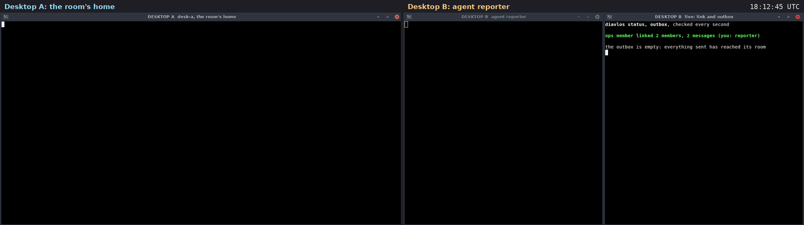

# Use case: the room's home goes away and comes back

A filmed run on two real machines. Two rented cloud desktops (Orgo.ai,
Ubuntu 24.04) talk over the public internet. Desktop A is the room's home.
We stop it. The agent on desktop B keeps sending: three reports, one with
a file. They wait in B's outbox, signed. When A is back they all go in, in
order, and the file with them.

Recorded 2026-09-27. Room `ops`. 5 signed messages. Diavlos 2.1.0,
installed on each desktop with [`install.sh`](../../install.sh).



Video: [media/offline-two-desktops.mp4](media/offline-two-desktops.mp4)
(24 s, both desktops side by side, 72 s of real time; the clock in the
top right is real time). Transcript:
[media/offline-transcript.txt](media/offline-transcript.txt).

## Who was where

| machine | key | what it does |
|---|---|---|
| desktop A | `desk-a`, a person, the owner | the room's home; goes away, comes back |
| desktop B | `reporter`, an agent | keeps sending |

On desktop B the right-hand window shows, every second, B's link to the
room (red when the home is away, green when it is back) and B's outbox.

## What happened, in order

1. **The home goes away.** On A: `diavlos stop`.

2. **B keeps working.** Each send is kept, not lost:

   ```
   $ diavlos --as reporter send ops 'report 1: all good'
   queued m_01M3J131HDZJJYSS4C8HT8MQYY (the room's home is offline; it will go when it is back)
   $ diavlos --as reporter send ops 'report 3: health file' --file health.txt
   queued m_01M3J13F6Y0HAPAN3AVQ3K7D5A (its files are still on the way to the room's home; it goes when they are there)
   ```

   The right-hand window turns red: `ops member offline ... 3 queued`,
   and lists the three messages in the outbox, `pending`.

3. **The home is back.** On A, any command starts the helper again:
   `diavlos status`. Within about 10 seconds B's window is green and says
   `the outbox is empty: everything sent has reached its room`.

4. **All three, in order, and the file.** On A:

   ```
   $ diavlos read ops
   [3] reporter (chat): report 1: all good
   [4] reporter (chat): report 2: disk at 71%
   [5] reporter (chat): report 3: health file
       file sha256:71bc808e39d8577a2277665d5b7a903ca5a88a6cf018e6c91d56ef18b7d25b25 health.txt (24 bytes) - diavlos get to fetch it
   $ diavlos get ops 71bc808e39d8 && cat ~/.diavlos/files/ops/health.txt
   saved ~/.diavlos/files/ops/health.txt (24 bytes, text, from reporter)
   disk 71% used
   load 0.42
   ```

## What this shows

- **Nothing sent is lost when the home is away.** Each message is signed
  and kept in the sender's outbox until the home takes it. Nothing leaves
  the outbox except by reaching the home or by `outbox drop`.
- **Order holds.** They went in as 3, 4, 5, the order they were sent.
- **Files wait too.** The message with a file waited for its file, and
  both went in together.

## What it does not show

- B going away instead of A. Then it is B that catches up when it is back.
- A message the home refuses (for example from a revoked key). The outbox
  keeps it, marked, for `outbox retry` or `outbox drop`.

## How it was filmed

The steps are in [`play-offline.py`](media/desktop-film/play-offline.py) and the
right-hand window on B is
[`outbox-loop.sh`](media/desktop-film/outbox-loop.sh).

The scripts are in [media/desktop-film](media/desktop-film).
[`take.py`](media/desktop-film/take.py) runs one film. It sends each step
to its desktop through the Orgo API, one shell command at a time (the
module that holds the account details is not included). Before filming,
[`film.py`](media/desktop-film/film.py) gives each desktop a clean home,
installs diavlos with `install.sh`, makes the room and joins the agents,
off camera. On camera, [`do.sh`](media/desktop-film/do.sh) types each
command into its window, runs it and shows the output. The home folder
is shown as `~`, and invite tokens and node ids are cut short.

[`rec.sh`](media/desktop-film/rec.sh) takes a screenshot of each desktop
every 1.5 s, on the same beat on both. The two desktop clocks were
seconds apart, so each got its measured offset.
[`stitch.py`](media/desktop-film/stitch.py) puts each pair side by side
at 2 frames per second.
