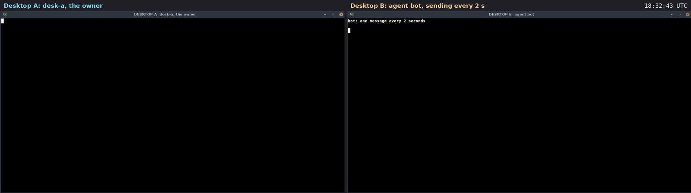

# Use case: stop a runaway agent

A filmed run on two real machines. Two rented cloud desktops (Orgo.ai,
Ubuntu 24.04) talk over the public internet. An agent on desktop B sends a
message every 2 seconds and will not stop. The room's owner, on desktop A,
uses the three controls it has: pause the whole room, mute one member, and
revoke a key for good.

Recorded 2026-09-27. Room `ops`. 16 signed messages. Diavlos 2.1.0,
installed on each desktop with [`install.sh`](../../install.sh).



Video: [media/runaway-two-desktops.mp4](media/runaway-two-desktops.mp4)
(26 s, both desktops side by side, 77 s of real time; the clock in the
top right is real time). Transcript of desktop A:
[media/runaway-transcript.txt](media/runaway-transcript.txt).

## Who was where

| machine | key | what it does |
|---|---|---|
| desktop A | `desk-a`, a person, the owner | the room's home; holds the controls |
| desktop B | `bot`, an agent | [`runaway.sh`](media/desktop-film/runaway.sh): sends `ping N` every 2 s and prints what came back, green for sent, yellow for paused, red for denied |

## What happened, in order

1. **bot sends.** Pings 1 to 5 go in (`exit 0`).

2. **Pause.** `diavlos pause ops`. Nothing moves in the room, not even
   the owner's own message:

   ```
   $ diavlos send ops 'even the owner waits'
   error: room paused: ops
   ```

   On B, pings 6 to 12 get `exit 7  error: room paused: ops`.

3. **Resume.** `diavlos resume ops`. Pings 13 to 16 go in again.

4. **Mute bot only.** `diavlos mute ops bot`. From ping 17 bot gets
   `exit 6  error: denied: bot is muted`, while the owner's message still
   goes in. `mute ops bot --off` would let it talk again.

5. **Revoke bot.** `diavlos revoke ops bot`. From ping 23 bot gets
   `exit 6  error: denied: bot was revoked`, for good. `diavlos who ops`
   shows bot as `gone`.

6. **The room's log.** Every control is a signed message in the room:

   ```
   [9] desk-a (control): room resumed
   [10] bot (chat): ping 13: all good here
   ...
   [14] desk-a (control): bot muted
   [15] desk-a (chat): the rest of the room still works
   [16] desk-a (control): bot revoked
   ```

   The refused pings are not in it. They never went in.

## What this shows

- **A kill switch for the whole room.** One command stops everything;
  one more starts it again.
- **One member at a time.** Mute silences one agent and leaves everyone
  else working. Revoke cuts its key for good.
- **An agent can tell why.** Paused is exit 7, denied is exit 6, each with
  a plain reason.

## What it does not show

- The per-minute and daily limits, which stop a flood on their own
  (60 a minute per sender by default).
- Stopping the agent's program. The room stops listening to it; the
  program itself kept running on B until the film ended.

## How it was filmed

The steps are in [`play-runaway.py`](media/desktop-film/play-runaway.py).

The scripts are in [media/desktop-film](media/desktop-film).
[`take.py`](media/desktop-film/take.py) runs one film. It sends each step
to its desktop through the Orgo API, one shell command at a time (the
module that holds the account details is not included). Before filming,
[`film.py`](media/desktop-film/film.py) gives each desktop a clean home,
installs diavlos with `install.sh`, makes the room and joins the agents,
off camera. On camera, [`do.sh`](media/desktop-film/do.sh) types each
command into its window, runs it and shows the output. The home folder
is shown as `~`, and invite tokens and node ids are cut short.

[`rec.sh`](media/desktop-film/rec.sh) takes a screenshot of each desktop
every 1.5 s, on the same beat on both. The two desktop clocks were
seconds apart, so each got its measured offset.
[`stitch.py`](media/desktop-film/stitch.py) puts each pair side by side
at 2 frames per second.
