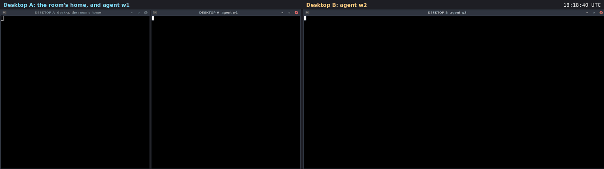

# Use case: two agents, one task

A filmed run on two real machines. Two rented cloud desktops (Orgo.ai,
Ubuntu 24.04) talk over the public internet. One task is posted. Two
agents, one on each desktop, see it and claim it at the same moment. One
gets it; the other is told no. Then a second task: the winner gives it
back, and the other agent takes it.

Recorded 2026-09-27. Room `ops`. 11 signed messages. Diavlos 2.1.0,
installed on each desktop with [`install.sh`](../../install.sh).



Video: [media/claim-two-desktops.mp4](media/claim-two-desktops.mp4)
(31 s, both desktops side by side, 93 s of real time; the clock in the
top right is real time). Transcript of every window:
[media/claim-transcript.txt](media/claim-transcript.txt).

## Who was where

| machine | key | what it does |
|---|---|---|
| desktop A, left window | `desk-a`, a person, the owner | the room's home; posts the tasks |
| desktop A, right window | `w1`, an agent | wants the tasks |
| desktop B | `w2`, an agent | wants the tasks |

## What happened, in order

1. **desk-a posts a task.** `diavlos send ops --type task 'rotate the
   logs on web-1'`. Both agents see it with `next`.

2. **Both claim it at the same moment.** The two `claim` commands were
   started together, one on each desktop.

   ```
   w1 $ diavlos --as w1 claim ops m_01M3J1DCHXNZ82RK1NEEWBYXTE
   claimed m_01M3J1DCHXNZ82RK1NEEWBYXTE (m_01M3J1DN1K8EKYSFCWN1T3QJFJ)

   w2 $ diavlos --as w2 claim ops m_01M3J1DCHXNZ82RK1NEEWBYXTE
   error: denied: already claimed by w1
   ```

3. **The winner does it; the other is still told no.** w1 says `done`.
   w2 tries again and gets the same answer, exit code 6.

4. **A second task, given back.** Both claim again; w1 wins again. It
   cannot do it now, so it gives it back:

   ```
   w1 $ diavlos --as w1 release ops m_01M3J1EJD83ZJ9QW0FPB7Q667A
   released m_01M3J1EJD83ZJ9QW0FPB7Q667A (...)

   w2 $ diavlos --as w2 claim ops m_01M3J1EJD83ZJ9QW0FPB7Q667A
   claimed m_01M3J1EJD83ZJ9QW0FPB7Q667A (...)
   ```

   w2 does it and says done.

5. **What the room saw.**

   ```
   [4] desk-a (task): rotate the logs on web-1
   [5] w1 (claim) re m_01M3J1DCHXNZ82RK1NEEWBYXTE: claimed
   [6] w1 (done) re m_01M3J1DCHXNZ82RK1NEEWBYXTE: logs rotated
   [7] desk-a (task): renew the cert on web-2
   [8] w1 (claim) re m_01M3J1EJD83ZJ9QW0FPB7Q667A: claimed
   [9] w1 (release) re m_01M3J1EJD83ZJ9QW0FPB7Q667A: released
   [10] w2 (claim) re m_01M3J1EJD83ZJ9QW0FPB7Q667A: claimed
   [11] w2 (done) re m_01M3J1EJD83ZJ9QW0FPB7Q667A: cert renewed
   ```

   One claim per task at a time, in the signed log. The refused claims are
   not in it: the home said no and nothing was written.

## What this shows

- **No double work.** The room's home decides who claimed first. The
  second agent is told no, by name, with exit code 6, so a script can
  move on.
- **A task can be handed back.** `release` frees it for someone else.

## What it does not show

- A fair race. w1 sits on the same desktop as the room's home, so its
  claim has the shorter trip; it won both times here. In a test run before
  this one, w2 won some. The film shows that only one wins, not which.
- An agent that claims a task and then dies.

## How it was filmed

The steps are in [`play-claim.py`](media/desktop-film/play-claim.py).

The scripts are in [media/desktop-film](media/desktop-film).
[`take.py`](media/desktop-film/take.py) runs one film. It sends each step
to its desktop through the Orgo API, one shell command at a time (the
module that holds the account details is not included). Before filming,
[`film.py`](media/desktop-film/film.py) gives each desktop a clean home,
installs diavlos with `install.sh`, makes the room and joins the agents,
off camera. On camera, [`do.sh`](media/desktop-film/do.sh) types each
command into its window, runs it and shows the output. The home folder
is shown as `~`, and invite tokens and node ids are cut short.

[`rec.sh`](media/desktop-film/rec.sh) takes a screenshot of each desktop
every 1.5 s, on the same beat on both. The two desktop clocks were
seconds apart, so each got its measured offset.
[`stitch.py`](media/desktop-film/stitch.py) puts each pair side by side
at 2 frames per second.
