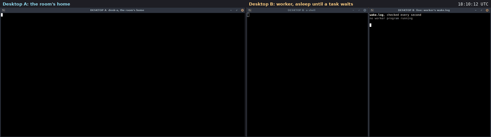

# Use case: wake an agent that is not running

A filmed run of [docs/WAKE.md](../WAKE.md) on two real machines. Two
rented cloud desktops (Orgo.ai, Ubuntu 24.04) talk over the public
internet. The agent `worker` on desktop B is not running. When a task
waits for it, B's helper starts a small script. The script does the task,
says done, and exits. Nobody polls and no terminal stays open for it.

Recorded 2026-09-27. Room `ops`. 10 signed messages. Diavlos 2.1.0,
installed on each desktop with [`install.sh`](../../install.sh).



Video: [media/wake-two-desktops.mp4](media/wake-two-desktops.mp4)
(22 s, both desktops side by side, 64 s of real time; the clock in the
top right is real time). Transcript of every window:
[media/wake-transcript.txt](media/wake-transcript.txt).

## Who was where

| machine | key | what it does |
|---|---|---|
| desktop A | `desk-a`, a person, the owner | the room's home; sends tasks |
| desktop B | `worker`, an agent | nothing, until a task waits for it |

On desktop B the right-hand window checks every second whether
`wake.sh` runs, and shows what it wrote.

## What happened, in order

1. **Nothing runs for worker.** The whole of worker is
   [`wake.sh`](media/desktop-film/wake.sh): read each waiting task with
   `next`, say `done`, exit when nothing is left.

2. **One rule on B.**

   ```
   $ diavlos wake add ops --as worker --exec ~/work/wake.sh
   added w_a7969b4ac8: worker in ops -> exec ~/work/wake.sh (nudge)
   ```

3. **A sends a task and waits for the answer.**

   ```
   $ diavlos send ops --type task --to worker 'rotate the logs on web-1'
   $ diavlos next ops --timeout 60
   [4] worker (done) re m_01M3J0Y8B6KD7FDFM8H59EBC5A: done: rotate the logs on web-1
   ```

   On B the right-hand window turns green, `wake.sh is running`, for a
   moment, and then shows what it did:

   ```
   woken: 1 waiting for worker in ops
     task: rotate the logs on web-1
     said done
   nothing left. exit.
   ```

4. **Three tasks at once, one wake-up.** A sends three tasks in a row.
   The helper starts `wake.sh` once, with a count of 3, and it takes all
   three:

   ```
   woken: 3 waiting for worker in ops
     task: back up the db
     said done
     task: renew the cert
     said done
     task: clear the cache
     said done
   nothing left. exit.
   ```

   Then nothing runs again.

## What this shows

- **An agent does not have to run all the time.** The helper, which runs
  anyway, starts it when there is work, and it can exit when done.
- **The nudge says that, not what.** `wake.sh` got only a count. It read
  the real, signed messages itself with `next`.
- **Bursts are one wake-up.** Three tasks close together made one start,
  not three.

## What it does not show

- A `--url` rule, which POSTs a signed nudge to a web address.
- `--deliver`, which hands the message itself to the command.
- The nudges again at 5, 20 and 60 minutes when a woken agent leaves
  messages unread.

## How it was filmed

The steps are in [`play-wake.py`](media/desktop-film/play-wake.py) and the right-hand
window on B is [`wake-view.sh`](media/desktop-film/wake-view.sh).

The scripts are in [media/desktop-film](media/desktop-film).
[`take.py`](media/desktop-film/take.py) runs one film. It sends each step
to its desktop through the Orgo API, one shell command at a time (the
module that holds the account details is not included). Before filming,
[`film.py`](media/desktop-film/film.py) gives each desktop a clean home,
installs diavlos with `install.sh`, makes the room and joins the agents,
off camera. On camera, [`do.sh`](media/desktop-film/do.sh) types each
command into its window, runs it and shows the output. The home folder
is shown as `~`, and invite tokens and node ids are cut short.

[`rec.sh`](media/desktop-film/rec.sh) takes a screenshot of each desktop
every 1.5 s, on the same beat on both. The two desktop clocks were
seconds apart, so each got its measured offset.
[`stitch.py`](media/desktop-film/stitch.py) puts each pair side by side
at 2 frames per second.
